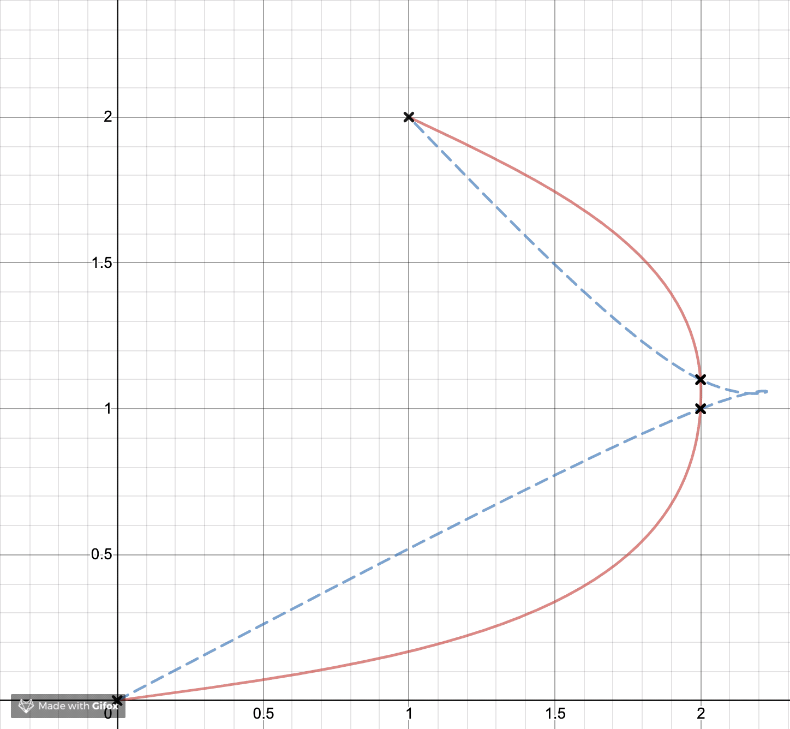
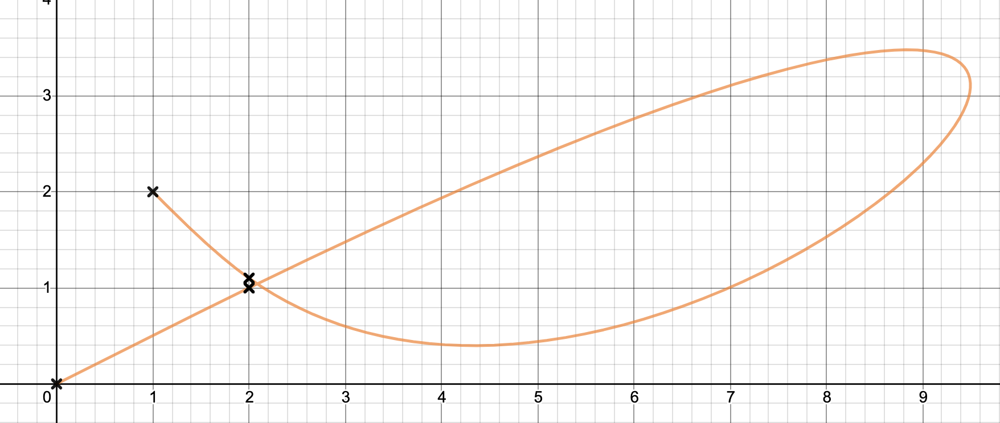

# Theory

## Intro
The `theory.pdf` file in this folder walks through the nitty gritty of the math, but the purpose of this module is fundamentally visual, so I'll do my best to show exactly what's going on here.

## Splines
If you found this module, you probably already know what splines are, but we'll be thorough anyway. A spline, according to Google, is 

> a continuous curve constructed so as to pass through a given set of points and have a certain number of continuous derivatives

The idea is that you have some set of points that you want a curve to pass through called "knots". You don't care specifically about the shape of said curve as long as it hits the stops you define along the way. You _could_ draw a straight line between the points, but that isn't aesthetically pleasing and makes for jagged corners when you might want a smooth transition. So the ultimate goal here is to be able to input a set of ordered knots and to get out some description of a curve that passes through those knots. We'll get to the continuity part later.

## Bezier Curves
Bezier curves are parametric cubic polynomials. You can see their definition in `theory.pdf` or by searching online, but it doesn't look good in markdown. You find them pretty often in computer graphics or design because they're versatile and make nice-looking curves. You can probably find a bezier curve function in whatever design software or graphics package/engine you use from Adobe Illustrator to Gimp to Blender to AutoCAD. They're also frequently used in animations; there's a CSS function for a cubic bezier. SVGs (and by extension the HTML canvas element) also have a quick interface for these, which was the original reason this package was made.

You'll see in their definition that they're also very easy to create. You only have to define the two endpoints and two control points to get a shape.


So bezier curves are widely supported, easy to use, and look nice. It sure would be convenient to be able to use them in a spline. That way you'd be able to define the knots, get out a set of control points, and then just plug those into whatever interface accepts bezier curve control points to get your visuals working. That's the motivation here. Given those options, it seems that a natural choice for an easy spline might be one made of a number of bezier curves. It's easy to plug bezier curves into software, and two of the four control points for a single bezier curve are the endpoints. We'll create one curve between the first two knots, another between the second and third knots, and so on. We end up with a piecewise parametric curve that passes through `n` knots and is defined by `n-1` cubic bezier curves. The problem that has to be solved now is how to determine the control points for each individual curve. This is what all that math in `theory.pdf` is doing.

## Continuity
I'll let that document speak for itself, but there is an issue that we come across eventually. For the spline to look good, the curve needs to look the same when two different bezier curves meet at the knots. That's how we determine where the control points will go. So the first thing we do is to force the first and second derivatives to be equal at the knots. This is mentioned in that Google definition of a spline. But if you use this constraint, you'll notice something that might be a bit of an annoyance if you put two knots too close to each other. You get loops that overshoot a nearby knot and then come back around:


This doesn't look great. If you're trying to make a spline on these points, it's entirely possible that you wanted something a little more rounded that just happened to pass through two nearby points on the right. Something more like the solid red line here:


The reason for these loops and jagged edges is our strict continuity restrictions. For the dotted blue line, we've said that the first and second derivatives must be **equal** at the knots. That makes sense; the tangent is the same as we pass from one curve to another, and as we force more and more derivatives to be equal, the curve looks more and more natural and less jagged at the knots. But once you've constrained the first and second derivatives to be continuous, it gets very hard to notice any further improvements to the smoothness, so we stop there. This is called C2 continuity.

To make things easier to picture, we can talk about these curves as the path traveled by a particle. Our curve is defined parametrically, so we'll use time as the parameter. The curve itself describes the position of a particle, the first derivative is its velocity, and the second derivative is its acceleration. Bezier curves are defined on the interval [0, 1], so it will take 1 unit of time (we'll say 1 second) to get from one knot to the next. You may be seeing what's happening now.



The particle only has 1 second to move from the start of the spline to the second knot. So it has to get up to speed. Once it hits the second knot it's going fairly quickly, it's not allowed to change its acceleration instantaneously, and it has to take an entire second to get to the third knot. So it has to burn off its initial speed by moving a large distance relative to the space between the knots.

This _is_ desirable for a particle moving along a path (or some similar pathing or animation that takes time). It looks realistic and smooth. But if you're just trying to draw something that looks nice where time has nothing to do with your curve, we don't really need to care about preserving this "speed" between knots. All we care about is that the curve is pointing in the same direction and doesn't suddenly change direction as it passes over a knot. This is G2 continuity.

G2 continuity is a relaxation of C2 continuity. Rather than forcing the velocity vectors to be equivalent, we only need them to point in the same direction. That is, the tangent unit vector is continuous. And instead of forcing acceleration to be equivalent, we only need curvature to be continuous. The solid red curve above is G2 continuous, but not C2 continuous. This is what a particle moving along that curve looks like:


Here, once the particle hits a knot, we immediately change its speed based on how far away the next knot is. That way we're not moving so fast that we have to take a wild loop to waste time before hitting the next knot. There is an equal and opposite effect too that's a little harder to notice in the C2 example. Under C2 continuity, the particle comes out of the third knot relatively slowly, so the relatively high acceleration needed to get it to the last knot in time takes over the initial speed for that segment of the curve. The result is that the curve between knots that are far apart relative to other knots becomes very straight. For this G2 continuous example, when the particle comes out of the third knot, we bump up its speed proportionally to the distance between the next two knots, and the acceleration has to do a little more to change the particle's direction, so the result is more of a curve.

All that particle talk doesn't matter for this example here though, because if we're talking about G2 continuity, it means we only care about the shape. This G2 continuous spline makes a nice-looking hill that happens to pass through two nearby points.

### Choosing a G2 Continuity
To state explicitly what may already be apparent, C2 continuity is a specific case of G2 continuity where the tangent vectors happen to have the same magnitude. So if we're relaxing from C2 to G2 continuity, we're allowed to scale the velocity vector across a knot by whatever value we want, and as long as we adhere to the rules described in `theory.pdf`, our spline will still be G2 continuous. The trick, then, is to pick a scalar that achieves the desired result. The red curve above, which is the default for this module, is to scale the velocity vector proportionally to the distance between the current and next knot relative to the distance between the previous knot and the current knot. So if the next knot is close by, we'll slow down for the next curve, and if the next knot is far away, we'll speed up. But there are other scalars you could use. For example:


Here is a spline where the scalar is the square root of the ratio of the distances between the knots. It achieves about the same effect as the red curve above, but softens the effect so that curves don't get blown out and short distances don't get too straight.



And here's one where we do the inverse of the same ratio. Now when we enter a curve where the two knots are close together, we blast off, and when they're far away we slow down.

You could also throw out the notion of distance between knots. Here's one where the scalar is equal to the polar distance of the second knot in a segment:


All of these examples are G2 continuous and achieve a different effect. It's all about how you want to affect a shape. You could set the scalar equal to the index of the current segment or the arclength of the previous segment or whatever other crazy thing you might care about.

An important note here is that if you want C2 continuity, that scalar should always be `1`.

## In This Module
Everything you've read is well and good, but you'll want to know specifically how to utilize the information. When you create a new spline, you can pass an optional argument `weights` after the list of knots.  This is a function that should take an argument `i`, which is the index of the current curve. It can also take a second argument `knots` which is a list of the knots you've just provided. It should return a number which will scale the velocity as the particle enters the current segment. `weights` could also be an array of precalculated knots.

Important notes: 
- `i` will start at `1` and count up to `n-1`. The first segment depends on other constraints, so there is no such thing as a scalar for the first segment. If `weights` is an array, the first element will be ignored.
- `knots` is the same list you provided in the constructor, but each knot will have been turned into a [vecn](https://github.com/Zunawe/vecn). This might help with whatever math you're doing.
- All weights are calculated before any control points are solved, and the `knots` provided is the actual object used in the calculations. So if for some reason you wanted to change the knots from within this function (please don't), the spline would be calculated as if you had set those values as the knots before creating the spline.

Here is the source code for the default weight function:
```js
const distanceRatio = (i, knots) => {
  let w1 = knots[i].minus(knots[i - 1]).magnitude
  let w2 = knots[i + 1].minus(knots[i]).magnitude
  return w1 / w2
}
```

This spline would use the above function:
```js
let spline = new BezierSpline(knots)
```

Or, if you wanted a spline that was C2 continuous:
```js
let spline = new BezierSpline(knots, () => 1)
```

And here's my polar distance example from earlier:
```js
let spline = new BezierSpline(knots, (i, knots) => knots[i].magnitude)
```

Or maybe you've precalculated the weights and want to pass them in as an array:
```js
let spline = new BezierSpline(knots, [null, 1, 3, 2.6, 2])
```

Generally you probably won't be doing anything crazy with the weights. The default and C2 continuity are probably good enough for almost any situation. But if you're feeling adventurous, go ahead and define your own weighting function.
